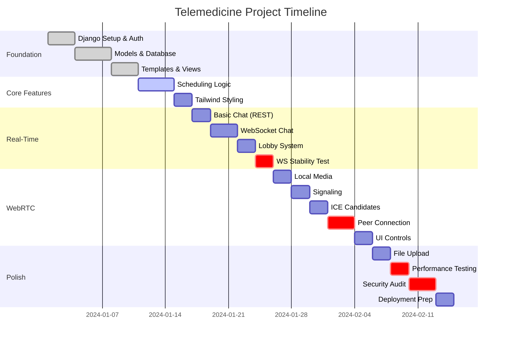
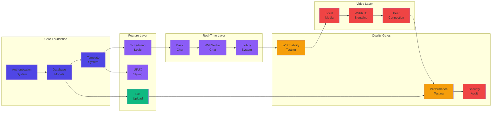

# TELEMEDICINE PROJECT - DEVELOPMENT FLOW DIAGRAM

## Visual Flow (Copy to Mermaid Live Editor: https://mermaid.live)

```mermaid
%%{init: {'theme':'base', 'themeVariables': { 'primaryColor':'#4f46e5','primaryTextColor':'#fff','primaryBorderColor':'#4338ca','lineColor':'#6366f1','secondaryColor':'#10b981','tertiaryColor':'#f59e0b'}}}%%

graph TD
    Start([START PROJECT]) --> Step1

    Step1[STEP 1: Foundation<br/>Django + Auth]
    Step1 --> Check1{✓ Server runs?<br/>✓ Users created?<br/>✓ Login works?}
    Check1 -->|NO| Fix1[FIX ISSUES]
    Fix1 --> Step1
    Check1 -->|YES| Step2

    Step2[STEP 2: Models & DB<br/>Hospital, Doctor, Patient<br/>Appointments]
    Step2 --> Check2{✓ Relations work?<br/>✓ Admin CRUD?<br/>✓ Test data?}
    Check2 -->|NO| Fix2[FIX ISSUES]
    Fix2 --> Step2
    Check2 -->|YES| Step3

    Step3[STEP 3: Templates<br/>Dashboards & Views]
    Step3 --> Check3{✓ Role-based access?<br/>✓ Data from DB?<br/>✓ No errors?}
    Check3 -->|NO| Fix3[FIX ISSUES]
    Fix3 --> Step3
    Check3 -->|YES| Step4

    Step4[STEP 4: Scheduling<br/>Appointments & Conflicts]
    Step4 --> Check4{✓ Create works?<br/>✓ No double-booking?<br/>✓ Logic correct?}
    Check4 -->|NO| Fix4[FIX ISSUES]
    Fix4 --> Step4
    Check4 -->|YES| Step5

    Step5[STEP 5: Styling<br/>Tailwind CSS]
    Step5 --> Check5{✓ Readable?<br/>✓ Forms usable?<br/>✓ Mobile OK?}
    Check5 -->|NO| Fix5[FIX ISSUES]
    Fix5 --> Step5
    Check5 -->|YES| Step6A

    Step6A[STEP 6A: Basic Chat<br/>REST/Polling]
    Step6A --> Check6A{✓ Messages save?<br/>✓ Data flow works?}
    Check6A -->|NO| Fix6A[FIX ISSUES]
    Fix6A --> Step6A
    Check6A -->|YES| Step6B

    Step6B[STEP 6B: Real-Time Chat<br/>WebSockets]
    Step6B --> Check6B{✓ Instant delivery?<br/>✓ Messages persist?<br/>✓ Auth works?}
    Check6B -->|NO| Fix6B[FIX ISSUES]
    Fix6B --> Step6B
    Check6B -->|YES| Step7

    Step7[STEP 7: Lobby System<br/>Presence Logic]
    Step7 --> Check7{✓ Waiting works?<br/>✓ Join updates?<br/>✓ State reliable?}
    Check7 -->|NO| Fix7[FIX ISSUES]
    Fix7 --> Step7
    Check7 -->|YES| Step7_5

    Step7_5[STEP 7.5: WS Stability<br/>Load Testing]
    Step7_5 --> Check7_5{✓ 10+ concurrent?<br/>✓ Reconnection?<br/>✓ Order preserved?}
    Check7_5 -->|NO| Fix7_5[FIX ISSUES]
    Fix7_5 --> Step7_5
    Check7_5 -->|YES| Step8A

    Step8A[STEP 8A: Local Media<br/>Camera/Mic Access]
    Step8A --> Check8A{✓ Permissions?<br/>✓ Preview works?}
    Check8A -->|NO| Fix8A[FIX ISSUES]
    Fix8A --> Step8A
    Check8A -->|YES| Step8B

    Step8B[STEP 8B: Signaling<br/>Offer/Answer SDP]
    Step8B --> Check8B{✓ SDP exchange?<br/>✓ Handshake OK?}
    Check8B -->|NO| Fix8B[FIX ISSUES]
    Fix8B --> Step8B
    Check8B -->|YES| Step8C

    Step8C[STEP 8C: ICE Candidates<br/>Connection Setup]
    Step8C --> Check8C{✓ Candidates sent?<br/>✓ Connection OK?}
    Check8C -->|NO| Fix8C[FIX ISSUES]
    Fix8C --> Step8C
    Check8C -->|YES| Step8D

    Step8D[STEP 8D: Peer Connection<br/>Video/Audio Stream]
    Step8D --> Check8D{✓ Both see video?<br/>✓ Audio works?}
    Check8D -->|NO| Fix8D[FIX ISSUES]
    Fix8D --> Step8D
    Check8D -->|YES| Step8E

    Step8E[STEP 8E: UI Controls<br/>Mute/End Call]
    Step8E --> Check8E{✓ Mute works?<br/>✓ End call OK?<br/>✓ Disconnect clean?}
    Check8E -->|NO| Fix8E[FIX ISSUES]
    Fix8E --> Step8E
    Check8E -->|YES| Step9

    Step9[STEP 9: File Upload<br/>Medical Documents]
    Step9 --> Check9{✓ Upload works?<br/>✓ Download OK?<br/>✓ Validation?}
    Check9 -->|NO| Fix9[FIX ISSUES]
    Fix9 --> Step9
    Check9 -->|YES| Step9_5

    Step9_5[STEP 9.5: Performance<br/>Optimization]
    Step9_5 --> Check9_5{✓ Dashboard fast?<br/>✓ Queries optimized?<br/>✓ No blocking?}
    Check9_5 -->|NO| Fix9_5[FIX ISSUES]
    Fix9_5 --> Step9_5
    Check9_5 -->|YES| Step10

    Step10[STEP 10: Security Audit<br/>Permissions & Validation]
    Step10 --> Check10{✓ Role access?<br/>✓ CSRF enabled?<br/>✓ Input validation?<br/>✓ Rate limiting?}
    Check10 -->|NO| Fix10[FIX CRITICAL]
    Fix10 --> Step10
    Check10 -->|YES| Step11

    Step11[STEP 11: Deployment Prep<br/>Production Config]
    Step11 --> Check11{✓ DEBUG=False?<br/>✓ Static files?<br/>✓ Fresh migration?<br/>✓ README complete?}
    Check11 -->|NO| Fix11[FIX ISSUES]
    Fix11 --> Step11
    Check11 -->|YES| Deploy

    Deploy([🚀 DEPLOYED])

    style Start fill:#10b981,stroke:#059669,stroke-width:3px
    style Deploy fill:#10b981,stroke:#059669,stroke-width:3px
    style Step1 fill:#4f46e5,stroke:#4338ca,stroke-width:2px
    style Step2 fill:#4f46e5,stroke:#4338ca,stroke-width:2px
    style Step3 fill:#4f46e5,stroke:#4338ca,stroke-width:2px
    style Step4 fill:#4f46e5,stroke:#4338ca,stroke-width:2px
    style Step5 fill:#4f46e5,stroke:#4338ca,stroke-width:2px
    style Step6A fill:#8b5cf6,stroke:#7c3aed,stroke-width:2px
    style Step6B fill:#8b5cf6,stroke:#7c3aed,stroke-width:2px
    style Step7 fill:#8b5cf6,stroke:#7c3aed,stroke-width:2px
    style Step7_5 fill:#f59e0b,stroke:#d97706,stroke-width:2px
    style Step8A fill:#ef4444,stroke:#dc2626,stroke-width:2px
    style Step8B fill:#ef4444,stroke:#dc2626,stroke-width:2px
    style Step8C fill:#ef4444,stroke:#dc2626,stroke-width:2px
    style Step8D fill:#ef4444,stroke:#dc2626,stroke-width:2px
    style Step8E fill:#ef4444,stroke:#dc2626,stroke-width:2px
    style Step9 fill:#4f46e5,stroke:#4338ca,stroke-width:2px
    style Step9_5 fill:#f59e0b,stroke:#d97706,stroke-width:2px
    style Step10 fill:#ef4444,stroke:#dc2626,stroke-width:3px
    style Step11 fill:#4f46e5,stroke:#4338ca,stroke-width:2px
```



## Color Legend:
- 🟢 **Green**: Start/Deploy milestones
- 🔵 **Blue**: Core features (Steps 1-5, 9, 11)
- 🟣 **Purple**: Real-time features (Steps 6-7)
- 🟠 **Orange**: Testing/validation checkpoints
- 🔴 **Red**: Critical/complex features (Step 8 WebRTC, Step 10 Security)

---

## Simplified Gantt Chart View



---

## Dependency Graph (What Depends on What)



---

## Risk Assessment Matrix

| Step | Risk Level | Complexity | Time Estimate | Critical Dependencies |
|------|-----------|------------|---------------|----------------------|
| 1. Foundation | 🟢 Low | Low | 3 days | None |
| 2. Models | 🟢 Low | Medium | 4 days | Step 1 |
| 3. Templates | 🟢 Low | Low | 3 days | Step 2 |
| 4. Scheduling | 🟡 Medium | Medium | 4 days | Step 3 |
| 5. Styling | 🟢 Low | Low | 2 days | Step 4 |
| 6A. Basic Chat | 🟢 Low | Low | 2 days | Step 5 |
| 6B. WebSocket Chat | 🟡 Medium | Medium | 3 days | Step 6A, Redis |
| 7. Lobby | 🟡 Medium | Medium | 2 days | Step 6B |
| 7.5. WS Stability | 🟠 High | Medium | 2 days | Step 7 |
| 8A. Local Media | 🟡 Medium | Medium | 2 days | Step 7.5 |
| 8B. Signaling | 🟠 High | High | 2 days | Step 8A |
| 8C. ICE | 🟠 High | High | 2 days | Step 8B |
| 8D. Peer Connection | 🔴 Critical | Very High | 3 days | Step 8C |
| 8E. UI Controls | 🟡 Medium | Medium | 2 days | Step 8D |
| 9. File Upload | 🟢 Low | Low | 2 days | Step 2 |
| 9.5. Performance | 🟡 Medium | Medium | 2 days | Step 9 |
| 10. Security | 🔴 Critical | Medium | 3 days | All previous |
| 11. Deployment | 🟡 Medium | Medium | 2 days | Step 10 |

**Total Estimated Time:** 45-50 days (6-7 weeks)

---

## Quick Reference Checklist

### ✅ STEP 1: Foundation
- [ ] Django project created
- [ ] Custom User model with roles
- [ ] Admin panel accessible
- [ ] Login/logout works
- [ ] Password validation works

### ✅ STEP 2: Models
- [ ] Hospital model created
- [ ] DoctorProfile with hospital FK
- [ ] PatientProfile with hospital FK
- [ ] Appointment model
- [ ] Availability model
- [ ] Test data in Django shell
- [ ] Queries work correctly

### ✅ STEP 3: Templates
- [ ] Base template
- [ ] Login page
- [ ] Dashboard for each role
- [ ] Doctor list/detail pages
- [ ] Patient list/detail pages
- [ ] Appointment pages
- [ ] Proper role-based access

### ✅ STEP 4: Scheduling
- [ ] Create appointment form
- [ ] Availability management
- [ ] Conflict detection
- [ ] Double-booking prevention
- [ ] Edit/cancel appointments
- [ ] Schedule display

### ✅ STEP 5: Styling
- [ ] Tailwind installed
- [ ] Responsive navbar
- [ ] Forms styled
- [ ] Tables styled
- [ ] Buttons consistent
- [ ] Mobile responsive

### ✅ STEP 6A: Basic Chat
- [ ] Message model
- [ ] Send message form
- [ ] Message list view
- [ ] Messages persist in DB

### ✅ STEP 6B: WebSocket Chat
- [ ] Channels installed
- [ ] Redis configured
- [ ] WebSocket consumer
- [ ] Instant message delivery
- [ ] Messages persist after refresh
- [ ] Authorization working

### ✅ STEP 7: Lobby
- [ ] Waiting room UI
- [ ] Join notification
- [ ] Leave notification
- [ ] Presence status
- [ ] Doctor can see waiting patients

### ✅ STEP 7.5: WS Stability
- [ ] Multiple concurrent connections
- [ ] Reconnection after drop
- [ ] Message ordering preserved
- [ ] No memory leaks
- [ ] 10+ concurrent users tested

### ✅ STEP 8A: Local Media
- [ ] getUserMedia works
- [ ] Camera permission
- [ ] Microphone permission
- [ ] Local preview displays

### ✅ STEP 8B: Signaling
- [ ] SDP offer created
- [ ] SDP answer created
- [ ] Exchange via WebSocket
- [ ] Handshake completes

### ✅ STEP 8C: ICE
- [ ] ICE candidates generated
- [ ] Candidates exchanged
- [ ] Connection established

### ✅ STEP 8D: Peer Connection
- [ ] Doctor sees patient video
- [ ] Patient sees doctor video
- [ ] Audio works both ways
- [ ] Connection stable

### ✅ STEP 8E: UI Controls
- [ ] Mute/unmute audio
- [ ] Mute/unmute video
- [ ] End call button
- [ ] Reconnect handling
- [ ] Error messages

### ✅ STEP 9: File Upload
- [ ] Upload form
- [ ] File validation (type/size)
- [ ] Files saved to media/
- [ ] Download works
- [ ] Authorization check
- [ ] Large file handling

### ✅ STEP 9.5: Performance
- [ ] Django Debug Toolbar installed
- [ ] Queries optimized (select_related)
- [ ] Pagination added
- [ ] Dashboard loads fast
- [ ] Static files optimized
- [ ] Load tested

### ✅ STEP 10: Security
- [ ] CSRF protection enabled
- [ ] SQL injection tested
- [ ] XSS prevention
- [ ] Role-based permissions
- [ ] WebSocket auth
- [ ] File upload validation
- [ ] Rate limiting
- [ ] Environment variables
- [ ] No secrets in code

### ✅ STEP 11: Deployment
- [ ] DEBUG=False works
- [ ] ALLOWED_HOSTS configured
- [ ] Static files collected
- [ ] Database migrations tested
- [ ] requirements.txt updated
- [ ] README.md written
- [ ] .env.example created
- [ ] Production settings separate

---

## Red Flags - Stop and Fix Immediately

🚨 **Migration conflicts** → Resolve before proceeding
🚨 **Circular imports** → Refactor code structure
🚨 **WebSocket not closing** → Fix connection lifecycle
🚨 **N+1 queries** → Add select_related/prefetch_related
🚨 **Hardcoded credentials** → Move to environment variables
🚨 **Console errors** → Debug before moving forward
🚨 **Broken tests** → Tests must pass
🚨 **Memory leaks** → Profile and fix

---

## Success Criteria

**The project is DONE when:**
1. ✅ Non-technical user can navigate without confusion
2. ✅ No console errors in browser
3. ✅ Video call works 9/10 times
4. ✅ Messages never lost
5. ✅ Unauthorized access impossible
6. ✅ Can deploy without manual changes
7. ✅ README complete enough for new developer
8. ✅ All security checks pass

---

## Useful Commands

```bash
# Development
python manage.py runserver
python manage.py shell_plus
python manage.py makemigrations
python manage.py migrate

# Testing
python manage.py test
pytest
pytest --cov

# Redis (for WebSockets)
redis-server
redis-cli ping

# Production
python manage.py collectstatic
python manage.py check --deploy
gunicorn telemedicine.wsgi:application
daphne -b 0.0.0.0 -p 8000 telemedicine.asgi:application
```

